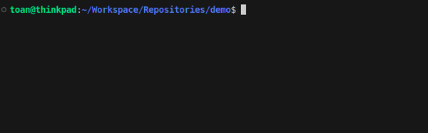

# GHEmoji

prepare-commit-msg hook for Gitmoji.

## Requirements

```
Python 3.8
Poetry 1.4.2
```

# Build

```
poetry install --dev
sh ./build.sh
```

# Install

```
cp ./dist/ghemoji ~/.local/bin/ghemoji
chmod +x ~/.local/bin/ghemoji
```

# Usage

## Commands

Install git hook:

```
ghemoji -i "path/to/repo"
```

Uninstall git hook:

```
ghemoji -u "path/to/repo"
```

## Commit



## Default emoji

_Notice: colon symbol - (:) at the end of text_

| Text      | Emoji | Description                          |
| --------- | ----- | ------------------------------------ |
| init:     | 🎉    | begin a project                      |
| feat:     | ✨    | introduce new features               |
| fix:      | 🚑️   | fix bug                              |
| style:    | 💄    | add or update the UI and style files |
| revert:   | ⏪️   | revert changes                       |
| pref:     | ⚡️   | improve performance                  |
| refactor: | ♻️    | refactor code                        |
| test:     | ✅    | add, update, or pass tests           |
| ci:       | 👷    | add or update CI build system        |
| typo:     | ✏️    | fix typos                            |
| docs:     | 📝    | add or update documentation          |

## Add or update emoji

Add or update emoji by create file `ghemoji.yaml` in your repo directory

```
replace:
  - "init:": 👌   # this will replace default "init:" by 👌
  - "beers:": 🍻  # this will replace "beers:" by 🍻 in commit message
```
